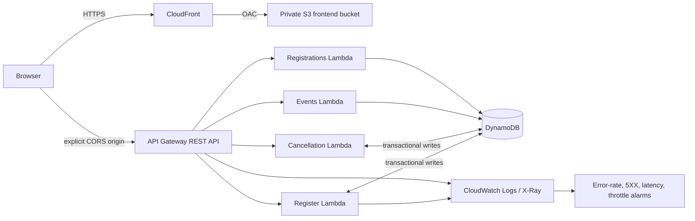

# Gatherly — Event Registration & Ticketing

Gatherly replaces a Forms-and-spreadsheet registration workflow with a responsive event discovery experience and a secure serverless API. AWS SAM/CloudFormation is the infrastructure source of truth; no production resource needs console creation.

## Architecture



CloudFront is the public frontend URL: it serves the Vite build from a private, encrypted S3 bucket using Origin Access Control (OAC), redirects HTTP to HTTPS, compresses assets, and supports SPA routes. API Gateway provides HTTPS, throttling, access logs/metrics, and a narrow CORS policy. Lambda keeps compute pay-per-use and contains small, independently deployable operations. DynamoDB on-demand tables avoid capacity management; transactions make the seat counter safe under concurrency. CloudWatch provides operational evidence without logging registrant PII.

## API

All responses follow `{ "success": true, "data": ... }` or `{ "success": false, "error": {"code", "message"} }`.

| Method | Path | Purpose |
| --- | --- | --- |
| POST | `/register` | Reserve one seat |
| GET | `/events` | Discover public events |
| GET | `/registrations/{email}` | Retrieve minimal ticket details |
| DELETE | `/registration/{id}` | Cancel idempotently |

```bash
curl -X POST "$API/register" -H 'content-type: application/json' \
  -d '{"event_id":"aws-workshop-accra-2026","name":"Ada Lovelace","email":"ada@example.com"}'
# 201: {"success":true,"data":{"registration_id":"…","ticket_id":"TKT-…","status":"ACTIVE"}}
curl "$API/events"
curl -X DELETE "$API/registration/<registration-id>"
```

`400 INVALID_EMAIL`, `409 DUPLICATE_REGISTRATION`, `409 EVENT_UNAVAILABLE`, and `404 REGISTRATION_NOT_FOUND` are expected application errors; no stack traces or DynamoDB details are returned.

## Data model and correctness

`EventsTable` has `event_id` as its key. It supports direct capacity updates and public discovery scans (appropriate for the small event catalogue; use a status/date access pattern if the catalogue grows). `RegistrationsTable` uses `registration_id` as the key and one justified `EmailIndex` GSI for lookup by email.

The registration ID is a UUIDv5 of normalized event ID + email. A transaction conditionally decrements an `OPEN` event only when seats are positive and conditionally puts that ID. Therefore two requests for the final seat cannot both succeed, and duplicate event/email pairs cannot race. Cancellation transactionally changes `ACTIVE → CANCELLED` and increments capacity only below its original capacity. Repeated cancellation is a successful no-op.

## Security

- Server and client validation, an 8 KB JSON body limit, normalised strings/email, explicit field allowlists, no raw PII in structured logs.
- Exact allowed origin parameter; never `*`; browser security headers on Lambda responses.
- REST-stage throttle: 25 requests/sec sustained, burst 50. Add AWS WAF rate-based rules at a custom-domain/CloudFront edge when the public traffic/risk profile warrants its recurring cost.
- Lambda roles are generated only with the table permissions each function requires; tables use AWS-owned encryption and point-in-time recovery.
- The lookup endpoint is required by the specification and is publicly callable by email, which is an enumeration tradeoff. It intentionally returns no email/name. For production with personal data, add Cognito magic-link authentication (or a signed, emailed lookup token) and a WAF rate rule before broad exposure.
- GitHub Actions uses OIDC (`AWS_DEPLOY_ROLE_ARN`), never long-lived access keys. Configure its trust policy for this repository and protected GitHub environments.

Secrets must use Secrets Manager/SSM and never Vite variables; `VITE_*` values are public by design. This app has no runtime secrets.

## Local development

Prerequisites: Python 3.12+, Docker, AWS SAM CLI, Node 22+.

```bash
python -m pip install -r requirements-dev.txt
python -m pytest
python -m ruff check backend
sam validate --lint
sam build
sam local start-api --parameter-overrides AllowedOrigin=http://localhost:5173

cd frontend
copy .env.example .env.local # macOS/Linux: cp .env.example .env.local
npm install
npm run dev
```

Set `VITE_API_BASE_URL` to the local SAM URL or the deployed `ApiBaseUrl`. The CI deployment workflow sets it automatically before publishing the frontend to the stack's private S3 bucket and invalidating CloudFront. Seed an empty deployed table deliberately (sample data is never created implicitly):

```bash
python scripts/seed_events.py --table event-ticketing-events-dev
```

## Deployment

Each stack creates a CloudFront distribution and emits `FrontendUrl`; it is automatically the API's allowed CORS origin. `samconfig.toml` contains dev/staging/prod profiles. Supply `AllowedOrigin` only when deliberately using a custom frontend domain.

```bash
sam deploy --config-env dev
sam deploy --config-env staging --parameter-overrides "Environment=staging EnableBudget=false"
sam deploy --config-env prod --parameter-overrides "Environment=prod EnableBudget=true BudgetAlertEmail=ops@example.com BudgetLimitUsd=25"
```

The production workflow deploys from `main` to a protected GitHub environment after CI. It retrieves the deployed API/bucket/distribution outputs, builds the frontend with the API URL, uploads immutable assets and a no-cache `index.html`, then invalidates CloudFront. Configure repository/environment values `AWS_REGION`, optional `ENABLE_BUDGET` and `BUDGET_ALERT_EMAIL`; configure `AWS_DEPLOY_ROLE_ARN` as an environment secret. The role needs scoped CloudFormation/S3 artifact and frontend upload/Lambda/API Gateway/DynamoDB/IAM pass-role/CloudFront invalidation permissions for this stack only.

## Operations and cost

The template creates a 5% Lambda error-rate metric-math alarm (`Errors / Invocations`), API 5XX, p95 latency (>2 seconds), and throttling alarms. JSON logs include request/operation/event or registration IDs, never full names/emails. X-Ray tracing is enabled.

Tables are on-demand, which is economical for irregular registrations but can cost more at sustained high traffic; Lambda/API logs and retained data are the other primary drivers. Enable the optional budget only after supplying an owner email and a suitable threshold. AWS pricing/free-tier eligibility changes, so review current pricing before production. Sample data is explicit and no expensive always-on compute, NAT gateway, or managed database is used.

## CI/CD

PRs and `main` run Python lint/tests, SAM validation/build, frontend build, and dependency review. Deployment uses short-lived GitHub OIDC credentials, runs SAM build/deploy, then smoke-tests `GET /events`. A failed command stops the workflow.

## Next production improvements

Add authenticated magic-link registration lookup, asynchronous SES confirmation via EventBridge/SQS, WAF managed/rate rules, an alarm SNS action, pagination for a large event catalogue, custom-domain/ACM support, and integration tests against a disposable AWS account.
